# Data Model (AI)

## 1. Database Diagram

```mermaid
erDiagram
    AUTH_USER {
        int id PK
    }

    Tag {
        int id PK
        string name
    }

    Book {
        int id PK
        string name
        text description
        int index
        int course_id FK
    }

    CapstoneTimeline {
        int id PK
        datetime date
        int capstone_id FK
        int status_id FK
    }

    Capstone {
        int id PK
        string proposal_url
        string repo_url
        text description
        int student_id FK
        int course_id FK
    }

    CohortCourse {
        int id PK
        boolean active
        int index
        int cohort_id FK
        int course_id FK
    }

    Course {
        int id PK
        string name
        date date_created
        boolean active
    }

    FoundationsExercise {
        int id PK
        string learner_github_id
        string learner_name
        string title
        string slug
        int attempts
        boolean complete
        datetime completed_on
        datetime first_attempt
        datetime last_attempt
        text completed_code
        boolean used_solution
    }

    FoundationsLearnerProfile {
        int id PK
        string learner_github_id
        string learner_name
        string cohort_type
        int cohort_number
    }

    LearningObjective {
        int id PK
        string swbat
        int bloom_level_id FK
    }

    LightningExercise {
        int id PK
        string name
        text description
    }

    LightningTag {
        int id PK
        int exercise_id FK
        int tag_id FK
    }

    ObjectiveTag {
        int id PK
        int objective_id FK
        int tag_id FK
    }

    ProjectNote {
        int id PK
        text note
        int user_id FK
        int project_id FK
    }

    ProjectTag {
        int id PK
        int project_id FK
        int tag_id FK
    }

    Project {
        int id PK
        string name
        string implementation_url
        string client_template_url
        string api_template_url
        int index
        boolean active
        boolean is_group_project
        int book_id FK
    }

    ProposalStatus {
        int id PK
        string status
    }

    StudentProject {
        int id PK
        date date_created
        int student_id FK
        int project_id FK
    }

    TaxonomyLevel {
        int id PK
        string level_name
    }

    Assessment {
        int id PK
        string name
        string source_url
        int book_id FK
        string type
    }

    AssessmentObjective {
        int id PK
        int assessment_id FK
        int objective_id FK
    }

    Cohort {
        int id PK
        string name
        string slack_channel
        date start_date
        date end_date
        date break_start_date
        date break_end_date
        boolean active
    }

    CohortEvent {
        int id PK
        int cohort_id FK
        string event_name
        int event_type_id FK
        datetime event_datetime
        text description
        datetime created_at
        datetime updated_at
    }

    CohortEventType {
        int id PK
        string description
        string color
    }

    CohortGithubProject {
        int id PK
        int cohort_id FK
        string project_name
        boolean assessment
        string project_url
    }

    CohortInfo {
        int id PK
        int cohort_id FK
        string student_organization_url
        string github_classroom_url
        string attendance_sheet_url
        string client_course_url
        string server_course_url
        string zoom_url
    }

    GroupProjectRepository {
        int id PK
        int team_id FK
        int project_id FK
        string repository
    }

    NssUser {
        int id PK
        int user_id FK
        string slack_handle
        string github_handle
    }

    NssUserCohort {
        int id PK
        int nss_user_id FK
        int cohort_id FK
        boolean is_github_org_member
    }

    NSSUserTeam {
        int id PK
        int team_id FK
        int student_id FK
    }

    OneOnOneNote {
        int id PK
        int student_id FK
        int coach_id FK
        text notes
        datetime session_date
    }

    Opportunity {
        int id PK
        int senior_instructor_id FK
        int cohort_id FK
        string portion
        date start_date
        text message
    }

    OpportunityUser {
        int id PK
        int student_id FK
        int opportunity_id FK
        date date_created
    }

    StudentAssessment {
        int id PK
        int student_id FK
        int assessment_id FK
        int status_id FK
        int instructor_id FK
        string url
        date date_created
    }

    StudentAssessmentStatus {
        int id PK
        string status
    }

    StudentMentor {
        int id PK
        int student_id FK
        int mentor_id FK
        int capstone_id FK
    }

    StudentNote {
        int id PK
        int student_id FK
        int coach_id FK
        int note_type_id FK
        text note
        datetime created_on
    }

    StudentNoteType {
        int id PK
        string label
    }

    StudentPersonality {
        int id PK
        int student_id FK
        string briggs_myers_type
        int bfi_extraversion
        int bfi_agreeableness
        int bfi_conscientiousness
        int bfi_neuroticism
        int bfi_openness
    }

    StudentTag {
        int id PK
        int student_id FK
        int tag_id FK
    }

    StudentTeam {
        int id PK
        string group_name
        int cohort_id FK
        boolean sprint_team
        string slack_channel
    }

    CoreSkill {
        int id PK
        string label
    }

    CoreSkillRecord {
        int id PK
        int student_id FK
        int skill_id FK
        int level
        date created_on
    }

    CoreSkillRecordEntry {
        int id PK
        int record_id FK
        text note
        date recorded_on
        int instructor_id FK
    }

    LearningWeight {
        int id PK
        string label
        int weight
        int tier
    }

    LearningRecord {
        int id PK
        int student_id FK
        int weight_id FK
        boolean achieved
        date created_on
    }

    LearningRecordEntry {
        int id PK
        int record_id FK
        text note
        date recorded_on
        int instructor_id FK
    }

    AssessmentWeight {
        int id PK
        int weight_id FK
        int assessment_id FK
    }

    AUTH_USER ||--|| NssUser : "has profile"
    Course ||--o{ Book : "contains"
    Book ||--o{ Project : "contains"
    Book ||--o{ Assessment : "has"
    Cohort ||--o{ CohortCourse : "offers"
    Course ||--o{ CohortCourse : "offered in"
    Cohort ||--|| CohortInfo : "has"
    Cohort ||--o{ CohortEvent : "schedules"
    CohortEventType ||--o{ CohortEvent : "categorizes"
    Cohort ||--o{ CohortGithubProject : "has"
    Cohort ||--o{ NssUserCohort : "includes"
    NssUser ||--o{ NssUserCohort : "belongs to"
    Cohort ||--o{ StudentTeam : "groups into"
    StudentTeam ||--o{ NSSUserTeam : "has member"
    NssUser ||--o{ NSSUserTeam : "joins"
    StudentTeam ||--o{ GroupProjectRepository : "submits"
    Project ||--o{ GroupProjectRepository : "linked to"
    NssUser ||--o{ Capstone : "proposes"
    Course ||--o{ Capstone : "for"
    Capstone ||--o{ CapstoneTimeline : "has history"
    ProposalStatus ||--o{ CapstoneTimeline : "labels"
    NssUser ||--o{ StudentMentor : "mentee"
    NssUser ||--o{ StudentMentor : "mentor"
    Capstone ||--o{ StudentMentor : "concerns"
    NssUser ||--o{ StudentProject : "completes"
    Project ||--o{ StudentProject : "assigned as"
    NssUser ||--o{ ProjectNote : "authors"
    Project ||--o{ ProjectNote : "documented by"
    Project ||--o{ ProjectTag : "tagged"
    Tag ||--o{ ProjectTag : "applied to"
    TaxonomyLevel ||--o{ LearningObjective : "classifies"
    LearningObjective ||--o{ ObjectiveTag : "tagged"
    Tag ||--o{ ObjectiveTag : "applied to"
    LearningObjective ||--o{ AssessmentObjective : "assessed by"
    Assessment ||--o{ AssessmentObjective : "targets"
    LightningExercise ||--o{ LightningTag : "tagged"
    Tag ||--o{ LightningTag : "applied to"
    NssUser ||--o{ OneOnOneNote : "receives"
    NssUser ||--o{ OneOnOneNote : "gives"
    NssUser ||--o{ Opportunity : "offers"
    Cohort ||--o{ Opportunity : "posted for"
    NssUser ||--o{ OpportunityUser : "applies"
    Opportunity ||--o{ OpportunityUser : "receives applicant"
    NssUser ||--o{ StudentAssessment : "takes"
    Assessment ||--o{ StudentAssessment : "assigned as"
    StudentAssessmentStatus ||--o{ StudentAssessment : "status of"
    NssUser ||--o{ StudentAssessment : "grades"
    NssUser ||--o{ StudentNote : "subject of"
    NssUser ||--o{ StudentNote : "authors"
    StudentNoteType ||--o{ StudentNote : "categorizes"
    NssUser ||--|| StudentPersonality : "has profile"
    NssUser ||--o{ StudentTag : "tagged"
    Tag ||--o{ StudentTag : "applied to"
    CoreSkill ||--o{ CoreSkillRecord : "tracked as"
    NssUser ||--o{ CoreSkillRecord : "has skill record"
    CoreSkillRecord ||--o{ CoreSkillRecordEntry : "has entry"
    NssUser ||--o{ CoreSkillRecordEntry : "authors"
    LearningWeight ||--o{ LearningRecord : "tracked as"
    NssUser ||--o{ LearningRecord : "has learning record"
    LearningRecord ||--o{ LearningRecordEntry : "has entry"
    NssUser ||--o{ LearningRecordEntry : "authors"
    LearningWeight ||--o{ AssessmentWeight : "weighted by"
    Assessment ||--o{ AssessmentWeight : "weighted for"
```

## 2. Database Info

**Database type:**
'ENGINE': 'django.db.backends.postgresql_psycopg2'

**ORM:**
Django's built-in ORM (this is a Django REST Framework project).

## 3. Model to Table Mapping

| Model Name                            | Table Name       |
| ------------------------------------- | ---------------- |
| LearningAPI/models/coursework/book.py | LearningAPI_book |

| Property Name | Column Name | Data Type             |
| ------------- | ----------- | --------------------- |
| id            | id          | integer               |
| name          | name        | character varying(75) |
| course        | course_id   | integer               |
| description   | description | text                  |
| index         | index       | integer               |

## 4. Relationship Examples

**One-to-one** (field name: cohort )

- File: LearningAPI/models/people/cohort_info.py
- Field: cohort = models.OneToOneField("Cohort", on_delete=models.CASCADE, related_name="info")
- Each Cohort has exactly one CohortInfo record (and vice versa) — Django's OneToOneField enforces uniqueness on the FK column, unlike a regular ForeignKey.

**One-to-many** (field name: course)

- File: LearningAPI/models/coursework/book.py
- Field: course = models.ForeignKey("Course", on_delete=models.CASCADE, related_name="books")
- One Course can have many Books, but each Book belongs to exactly one Course. This is the plain ForeignKey — the most common relationship type in this codebase.

**Many-to-many** (field name: assessment)

- File: LearningAPI/models/people/assessment.py
- Field: objectives = models.ManyToManyField("LearningWeight", through="AssessmentWeight")
- An Assessment can target many LearningWeights, and a LearningWeight can apply to many Assessments. It uses an explicit through model (AssessmentWeight, defined in LearningAPI/models/skill/assessment_weight.py) rather than Django's auto-generated join table — likely because AssessmentWeight needs its own identity/fields beyond just the two FKs.
