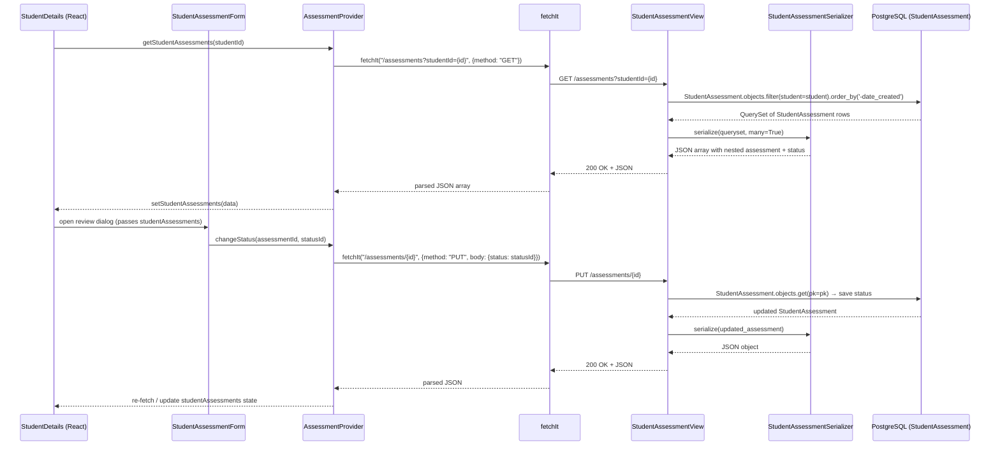

# Trace Notes (AI): assessments (learn-ops-api)

### Request path table from Claude

| Layer      | File                                                                | Class / Function                                                       | What it does                                                                                                                                       |
| ---------- | ------------------------------------------------------------------- | ---------------------------------------------------------------------- | -------------------------------------------------------------------------------------------------------------------------------------------------- |
| UI dialog  | `learn-ops-client/src/components/people/StudentAssessmentForm.js`   | `StudentAssessmentForm`                                                | Dialog where an instructor reviews a student's assessment; on save calls `PUT /students/{id}/assess`                                               |
| API helper | `learn-ops-client/src/components/assessments/AssessmentProvider.js` | `getStudentAssessments(studentId)`                                     | Calls `GET /assessments?studentId={id}` via `fetchIt`, stores results in `studentAssessments` context state                                        |
| URL router | `learn-ops-api/LearningPlatform/urls.py:26`                         | `router.register(r'assessments', StudentAssessmentView, 'assessment')` | Registers the DRF DefaultRouter route; maps `/assessments` and `/assessments/<pk>` to the viewset                                                  |
| View       | `learn-ops-api/LearningAPI/views/student_assessment.py:38`          | `StudentAssessmentView(ViewSet)`                                       | Handles list (filtered by `studentId`), retrieve, create (instructor-only), and destroy; enforces `StudentAssessmentPermission`                    |
| Serializer | `learn-ops-api/LearningAPI/views/student_assessment.py:168`         | `StudentAssessmentSerializer`                                          | Serializes `StudentAssessment` with nested `AssessmentSerializer` (id, name, objectives) and computed `status` and `instructor_username` fields    |
| DB         | `learn-ops-api/LearningAPI/models/people/student_assessment.py`     | `StudentAssessment`                                                    | ORM model linking `NssUser` (student) → `Assessment` → `StudentAssessmentStatus`; queried with `filter(student=student).order_by('-date_created')` |
| UI refresh | `learn-ops-client/src/components/people/StudentDetails.js`          | `useEffect` → `getStudentAssessments`                                  | Re-fetches assessments when `activeStudent` changes, repopulating the context and re-rendering the assessment list                                 |

### Sequence Diagram

