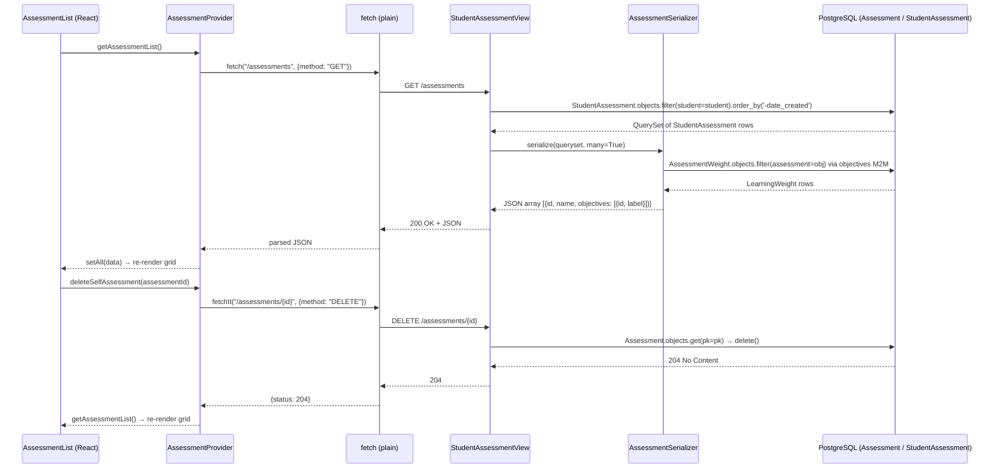

# Trace Notes (AI): AssessmentList (learn-ops-client)

### Request path table from Claude

| Layer      | File | Class / Function | What it does |
| ---------- | ---- | ---------------- | ------------ |
| UI dialog  | `learn-ops-client/src/components/assessments/AssessmentList.js` | `AssessmentList` | Renders a grid of assessment cards (name, objectives, edit/delete buttons); calls `getAssessmentList()` on mount |
| API helper | `learn-ops-client/src/components/assessments/AssessmentProvider.js` | `getAssessmentList()` | Calls `GET /assessments` with a plain `fetch()` (no `fetchIt`) and populates `allAssessments` state via `setAll()` |
| URL router | `learn-ops-api/LearningPlatform/urls.py:25` | `router.register(r'assessments', StudentAssessmentView, 'assessment')` | Registers DRF DefaultRouter route; maps `GET /assessments` to `StudentAssessmentView.list()` |
| View       | `learn-ops-api/LearningAPI/views/student_assessment.py:95` | `StudentAssessmentView.list()` | Filters `StudentAssessment` by `studentId` query param and serializes with `StudentAssessmentSerializer`; returns 400 if `studentId` is absent |
| Serializer | `learn-ops-api/LearningAPI/views/student_assessment.py:160` | `AssessmentSerializer` | Serializes `Assessment` returning `id`, `name`, and nested `objectives` (id + label); notably missing `source_url`, `assigned_book`, and `course` fields |
| DB         | `learn-ops-api/LearningAPI/models/people/assessment.py` | `Assessment` | ORM model with `name`, `source_url`, `book` FK, `type`, and a ManyToMany to `LearningWeight` through `AssessmentWeight`; queried via `StudentAssessment.objects.filter(student=student)` |
| UI refresh | `learn-ops-client/src/components/assessments/AssessmentList.js` | `deleteSelfAssessment(id).then(getAssessmentList)` | Re-fetches the full assessment list after a deletion to keep the grid in sync |

### Sequence Diagram

