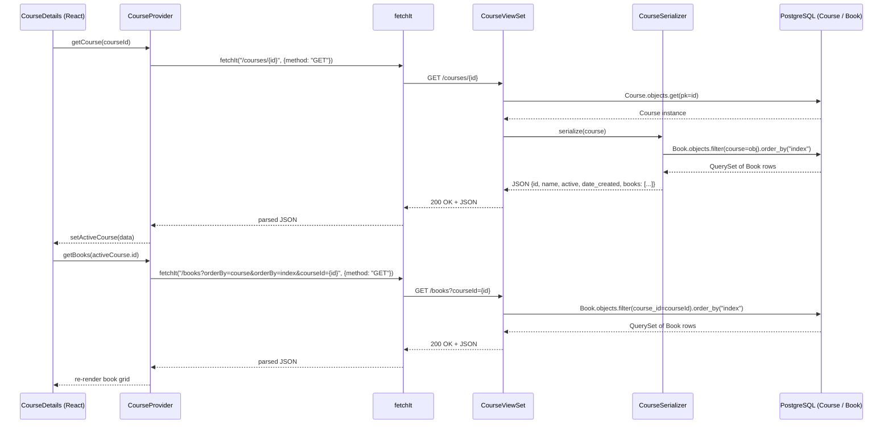

# Trace Notes (AI): CourseDetails (learn-ops-client)

### Request path table from Claude

| Layer      | File                                                       | Class / Function                                       | What it does                                                                                                                      |
| ---------- | ---------------------------------------------------------- | ------------------------------------------------------ | --------------------------------------------------------------------------------------------------------------------------------- |
| UI dialog  | `learn-ops-client/src/components/course/CourseDetails.js`  | `CourseDetails`                                        | Renders course name, a grid of books, and action buttons (add book, edit, delete); calls `getCourse` and `getBooks` on mount      |
| API helper | `learn-ops-client/src/components/course/CourseProvider.js` | `getCourse(id)`                                        | Calls `GET /courses/{id}` via `fetchIt` and stores result in `activeCourse` context state                                         |
| URL router | `learn-ops-api/LearningPlatform/urls.py:36`                | `router.register(r'courses', CourseViewSet, 'course')` | Registers DRF DefaultRouter route; maps `GET /courses/{id}` to the viewset's retrieve action                                      |
| View       | `learn-ops-api/LearningAPI/views/course_view.py:43`        | `CourseViewSet.retrieve()`                             | Looks up course by pk, increments a Prometheus metric, logs the event, serializes with `CourseSerializer`, and returns 200 or 404 |
| Serializer | `learn-ops-api/LearningAPI/views/course_view.py:184`       | `CourseSerializer`                                     | Returns `id`, `name`, `active`, `date_created`, and a nested `books` array (each book includes its projects and assessments)      |
| DB         | `learn-ops-api/LearningAPI/models/coursework/course.py`    | `Course`                                               | ORM model with `name`, `active`, and `date_created` fields; queried with `Course.objects.get(pk=pk)`                              |
| UI refresh | `learn-ops-client/src/components/course/CourseDetails.js`  | `useEffect` → `getCourse` + `getBooks`                 | Re-fetches course and its books when the `courseId` param changes, re-rendering the book grid                                     |

### Sequence Diagram

